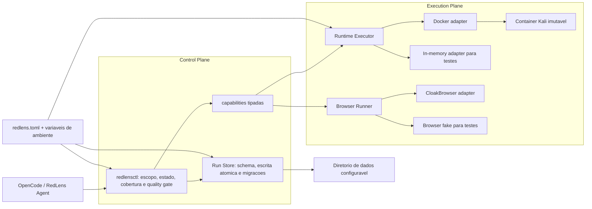

# Plano de amadurecimento do RedLens

Status: proposta para alinhamento tecnico
Baseline: 2026-07-27
Nota atual estimada: 7,5/10
Meta: 9/10 em portabilidade, manutencao e reprodutibilidade

Implementacao atual: milestones `portable-bootstrap`, `run-store` e
`browser-runner` entregues; a migracao completa de todos os callers e a
operacao de release continuam como proximo ciclo. O runtime operacional ja foi
adotado pelo Compose com rollback preservado.

## 1. Objetivo

Transformar o RedLens de uma instalacao funcional vinculada a uma maquina em um
produto que possa ser instalado, atualizado, testado e operado por qualquer
desenvolvedor autorizado, sem editar paths locais nem reconstruir o ambiente
manualmente.

Ao final, um desenvolvedor deve conseguir:

1. obter o codigo em uma maquina limpa;
2. executar um unico comando de bootstrap;
3. iniciar o runtime;
4. executar o health check;
5. receber `ok: true`;
6. preservar ou migrar operacoes existentes sem perda de evidencias.

## 2. Diagnostico atual

### Pontos fortes

- Autorizacao e escopo sao obrigatorios antes de qualquer operacao.
- O estado e as evidencias sao persistidos fora do container.
- O toolkit Kali esta isolado no Docker.
- Os wrappers e adapters restringem os comandos executados.
- O health check falha de forma fechada quando uma capacidade obrigatoria falta.
- O projeto possui uma suite relevante de testes locais.
- As operacoes possuem estado versionado e escrita atomica em partes do engine.

### Limitadores observados

- Paths absolutos ligados ao usuario e ao volume atual aparecem em wrappers,
  adapters, testes e documentacao.
- O runtime principal nao possui um `compose.yaml` nem um bootstrap idempotente.
- Varios adapters conhecem diretamente Docker, o nome `kali-pentest` e
  `docker exec`.
- O Dockerfile usa Kali rolling e dependencias sem lock completo.
- Binarios vendorizados nao possuem manifesto de versao, origem e checksum.
- O virtualenv e o cache do CloakBrowser ficam dentro da arvore do produto.
- O projeto nao esta atualmente inicializado como repositorio Git.
- A suite depende implicitamente da versao do Python: com Python 3.9, 167 testes
  executaram e um modulo falhou ao importar por usar sintaxe de Python 3.10+.
- Logs de testes imprimem grandes volumes de JSON, reduzindo a legibilidade da CI.
- O container web foi iniciado com privilegios e rede mais amplos que o
  necessario para a maioria das capacidades web.

## 3. Principios da arquitetura-alvo

1. **Configuracao e dado, nao codigo.** Nenhum path de usuario, volume ou nome de
   container deve estar gravado na implementacao.
2. **Uma interface de execucao.** Adapters pedem a execucao de uma capability;
   somente o modulo de runtime conhece Docker.
3. **Uma interface de persistencia.** Engine e adapters usam um modulo de
   armazenamento para ler, escrever e migrar operacoes.
4. **Defaults seguros.** O perfil web deve iniciar sem `privileged` e sem
   `network: host`; privilegios adicionais exigem perfil e autorizacao explicitos.
5. **Inputs de build identificaveis.** Base, pacotes, wheels e binarios devem ter
   versao, origem e checksum registrados.
6. **Codigo separado de dados gerados.** Runs, caches, virtualenvs, backups e
   artefatos nao pertencem a arvore versionada do produto.
7. **Migracao incremental.** Cada fase deve manter o health check verde e permitir
   rollback para a versao anterior.

## 4. Arquitetura-alvo



### Modulos profundos propostos

#### Configuration

Interface externa:

```python
config = load_config()
```

O modulo esconde descoberta de paths, defaults, validacao, plataforma,
container, runtime e diretorios de dados. A precedencia recomendada e:

1. argumentos de CLI;
2. variaveis `REDLENS_*`;
3. arquivo `redlens.toml`;
4. defaults portaveis.

#### Runtime Executor

Interface externa:

```python
result = runtime.execute(request)
```

`request` deve ser tipado e criado pela capability registry. A interface nao
aceita uma linha de shell arbitraria. O adapter Docker concentra nome do
container, timeout, captura de saida, limites e erros. Um adapter em memoria
permite testar o mesmo contrato sem Docker.

#### Run Store

Interface externa:

```python
run = store.open(run_id)
store.record(event)
store.migrate(run_id)
```

O modulo concentra layout, permissoes, schema, escrita atomica, locking,
backup e migracoes. Callers nao devem montar paths internos de `runs/`.

#### Browser Runner

Interface externa:

```python
capture = browser.navigate(request)
```

O adapter CloakBrowser continua como implementacao principal. Um adapter fake
serve aos testes. Um segundo adapter real so deve ser mantido se houver uma
plataforma suportada que nao execute CloakBrowser.

## 5. Roadmap

As estimativas abaixo estao em pessoa-dia e assumem revisao por outro
desenvolvedor. Nao incluem novas capabilities ofensivas.

### Status da implementacao

- Fases 0 e 1: implementadas no bootstrap, empacotamento, configuracao e Git.
- Fase 2: implementada para o runtime principal, Compose e Runtime Executor.
  A adocao operacional foi concluida com preflight, rollback e perfil web sem
  privilegios adicionais.
- Fase 3: parcialmente implementada com digest da base, versoes diretas e
  checksums; snapshot apt completo e lock com hashes continuam pendentes.
- Fase 4: implementado o `RunStore`, backup antes de migracao, `--dry-run` e
  manifesto de schema; migracao de todos os callers continua incremental.
- Fase 5: implementado o `BrowserRunner` configuravel; instalacao limpa do
  CloakBrowser e matriz macOS/Linux continuam pendentes.
- Fase 6: CI agora valida manifesto, build da imagem e smoke das ferramentas;
  releases, upgrade fixture e runbook operacional continuam pendentes.

### Fase 0 - Baseline e governanca

Prioridade: P0
Estimativa: 1-2 pessoa-dias

Entregaveis:

- Inicializar o projeto como repositorio Git privado.
- Criar `.gitignore` para runs privados, caches, virtualenvs, backups e outputs.
- Preservar o snapshot atual fora da arvore versionada.
- Fixar inicialmente Python `3.12.x`, ja usado pelo runtime do navegador, e
  ampliar a matriz somente depois de validacao.
- Criar `CONTRIBUTING.md`, owners de codigo e fluxo de pull request.
- Registrar o health atual e o manifesto das 15 ferramentas como baseline.
- Separar testes silenciosos de diagnosticos verbosos.

Aceite:

- Nenhuma evidencia privada entra no Git.
- A suite roda com uma versao declarada do Python.
- Todo merge exige review e checks verdes.
- O health atual continua retornando `ok: true`.

### Fase 1 - Configuracao portavel e empacotamento

Prioridade: P0
Estimativa: 3-4 pessoa-dias

Entregaveis:

- Implementar o modulo `Configuration`.
- Substituir paths absolutos por configuracao validada.
- Adicionar `pyproject.toml` e console scripts para `redlensctl`,
  `redlens-health` e wrappers.
- Remover a dependencia de symlinks em um diretorio pessoal fixo.
- Atualizar prompts e documentacao para usar comandos encontrados no `PATH`.
- Definir diretorios padrao por plataforma:
  - config: XDG ou equivalente;
  - dados: XDG ou diretorio informado;
  - cache: XDG ou equivalente.

Aceite:

- A busca automatizada pelos paths legados nao encontra ocorrencias no codigo
  executavel nem na documentacao ativa.
- O RedLens funciona quando o diretorio do projeto e movido.
- Dois usuarios diferentes conseguem instalar os CLIs sem editar arquivos.
- O health verifica localizacao configurada, nao o nome fisico `ADATA`.

### Fase 2 - Runtime declarativo e seam de execucao

Prioridade: P0
Estimativa: 4-6 pessoa-dias

Entregaveis:

- Criar `compose.yaml` principal com volumes relativos/configuraveis.
- Implementar o modulo `Runtime Executor`.
- Migrar todos os `docker exec` espalhados para o adapter Docker.
- Criar adapter em memoria para testes de capabilities.
- Criar comandos idempotentes:
  - `redlens runtime build`;
  - `redlens runtime up`;
  - `redlens runtime down`;
  - `redlens doctor`.
- Separar perfis:
  - `web`: sem privilegios adicionais;
  - `network`: privilegios minimos documentados;
  - `lab`: capacidades explicitamente habilitadas.

Aceite:

- Fora do modulo de runtime e dos testes, nao existe chamada direta a Docker.
- `docker compose up -d` recria o runtime sem passos manuais.
- Recriar o container nao remove runs nem evidencias.
- O perfil web passa o health sem `privileged` e sem `network: host`, se as
  capabilities atuais nao demonstrarem necessidade tecnica.
- Capacidades que exigem privilegio falham fechadas fora do perfil correto.

### Fase 3 - Build reproduzivel e supply chain

Prioridade: P0
Estimativa: 4-6 pessoa-dias

Entregaveis:

- Fixar a imagem base por digest.
- Usar snapshot datado do repositorio Kali ou publicar uma base interna
  imutavel com manifesto de pacotes.
- Fixar dependencias Python com hashes.
- Criar `tools.lock` com nome, versao, origem, licenca e SHA-256.
- Substituir binarios opacos de Katana e Dalfox por downloads verificados no
  build ou artefatos versionados com proveniencia.
- Gerar SBOM e manifesto de versoes em cada release.
- Publicar imagem com tag semantica e digest imutavel.
- Validar builds `arm64` e `amd64`, ou declarar formalmente uma arquitetura.

Aceite:

- A mesma release resolve exatamente o mesmo conjunto de inputs.
- Todo binario possui origem e checksum verificavel.
- O health apresenta versoes esperadas e detecta drift.
- Uma imagem publicada pode ser restaurada pelo digest.
- A equipe consegue explicar e auditar o conteudo da imagem.

### Fase 4 - Persistencia, schemas e migracoes

Prioridade: P1
Estimativa: 3-5 pessoa-dias

Entregaveis:

- Implementar o modulo `Run Store`.
- Versionar todos os documentos persistidos, nao apenas parte do estado.
- Criar migracoes incrementais e idempotentes.
- Adicionar `redlens migrate --dry-run` e backup antes de migrar.
- Definir politica de retencao para raw evidence, sanitized evidence e logs.
- Separar dados privados de artefatos compartilháveis.
- Testar interrupcao durante escrita e recuperacao de lock stale.

Aceite:

- Uma run antiga abre ou informa claramente a migracao necessaria.
- Migracao nunca sobrescreve o original sem backup.
- Falha no meio de uma escrita nao deixa JSON parcial.
- Relatorios continuam reproduziveis a partir dos dados persistidos.

### Fase 5 - Runtime do navegador portavel

Prioridade: P1
Estimativa: 3-5 pessoa-dias

Entregaveis:

- Remover `cloakbrowser-venv` e cache da arvore versionada.
- Criar instalacao reproduzivel do browser runtime via bootstrap.
- Formalizar o modulo `Browser Runner`.
- Declarar matriz de suporte para macOS e Linux.
- Centralizar cache, downloads e diagnostico do navegador.
- Testar navegacao local sem acessar alvos externos.

Aceite:

- Uma maquina limpa instala o browser runtime sem copiar um virtualenv.
- O cache pode ser apagado e reconstruido.
- O health diferencia claramente: ausente, degradado e operacional.
- Testes do Browser Runner nao dependem de navegador real.

### Fase 6 - CI, releases e operacao

Prioridade: P1
Estimativa: 4-6 pessoa-dias

Entregaveis:

- CI com lint, testes, typecheck progressivo, build de imagem e smoke test.
- Teste de instalacao em ambiente limpo.
- Teste de upgrade preservando uma fixture de run anterior.
- Release semantica, changelog e notas de migracao.
- Runbook de instalacao, upgrade, rollback, backup e recuperacao.
- Renovacao automatizada e revisada de dependencias.
- Benchmark separado dos testes de produto.

Aceite:

- Pull requests bloqueiam regressao de testes, build ou health.
- Uma release inclui codigo, imagem, lockfiles, SBOM e instrucoes de upgrade.
- O rollback restaura runtime e schema compativeis.
- Um desenvolvedor novo executa o quickstart sem conhecimento tribal.

## 6. Ordem recomendada e dependencias

```text
Fase 0
  |
  v
Fase 1 -> Fase 2 -> Fase 3
             |
             +-----> Fase 5
             |
             +-----> Fase 4
                        |
                        v
                      Fase 6
```

Fases 4 e 5 podem ocorrer em paralelo depois que Configuration e Runtime
Executor estiverem estaveis.

Estimativa total: 19-30 pessoa-dias. Com duas pessoas e revisao cruzada, a
execucao tende a ocupar de tres a seis semanas, dependendo da disponibilidade
de CI multi-plataforma e do trabalho para fixar dependencias Kali.

## 7. Divisao sugerida entre socios

### Responsavel por Control Plane

- Configuration.
- Run Store e migracoes.
- Engine, quality gate e relatorios.
- Testes de contrato e compatibilidade de schemas.

### Responsavel por Execution Plane

- Runtime Executor.
- Compose, imagem Kali e perfis de privilegio.
- Lock de ferramentas, SBOM e builds multi-arquitetura.
- Browser Runner e instalacao do CloakBrowser.

### Responsabilidade compartilhada

- Revisao de interfaces.
- Threat modeling de cada mudanca.
- CI, release, documentacao e testes de upgrade.
- Aprovacao de qualquer aumento de privilegio ou acesso a dados.

## 8. Estrategia de migracao

1. Congelar o runtime atual como baseline recuperavel.
2. Introduzir Configuration mantendo compatibilidade com `REDLENS_HOME`.
3. Empacotar os CLIs sem remover imediatamente os wrappers antigos.
4. Introduzir Runtime Executor e migrar um adapter por vez.
5. Colocar Compose em paralelo com o container atual.
6. Validar `ok: true`, testes e uma run de laboratorio.
7. Trocar o runtime padrao.
8. Migrar o armazenamento somente depois do runtime estabilizado.
9. Remover compatibilidade legada em uma release major posterior.

Cada fase deve ter rollback documentado. Backups nao devem permanecer dentro
do repositorio principal.

## 9. Metricas de acompanhamento

| Metrica | Baseline | Meta |
|---|---:|---:|
| Paths absolutos de usuario/volume no codigo ativo | varios | 0 |
| Chamadas Docker fora do Runtime Executor | varias | 0 |
| Passos manuais para instalar | varios | 1 comando |
| Inputs de build sem versao/checksum | varios | 0 |
| Testes em Python suportado | parcial | 100% verdes |
| Rebuild preserva runs | manual | automatizado |
| Plataformas declaradas e testadas | 1 maquina | macOS + Linux, ou escopo explicito |
| Health apos instalacao limpa | nao automatizado | `ok: true` |

## 10. Definition of Done para "compartilhavel"

O RedLens sera considerado pronto para distribuicao interna quando:

- estiver em repositorio Git privado com historico e revisao;
- nao contiver paths, usuarios ou volumes especificos;
- nao versionar credenciais, runs privadas, caches, virtualenvs ou backups;
- tiver bootstrap idempotente e runtime declarativo;
- tiver dependencias e binarios rastreaveis;
- passar testes e health em uma maquina limpa;
- preservar dados durante upgrade e rebuild;
- operar com menor privilegio por padrao;
- possuir quickstart, runbook e politica de release;
- permitir que um socio instale e execute sem orientacao oral.

## 11. Primeira milestone recomendada

Escopo da milestone `portable-bootstrap`:

1. Git privado e higiene da arvore.
2. Python e dependencias declarados.
3. Configuration sem paths absolutos.
4. CLIs instalaveis via `pyproject.toml`.
5. `compose.yaml` e `redlens doctor`.
6. CI com testes e smoke health.

Resultado esperado: mover o projeto para outro path ou outra conta de usuario,
executar o bootstrap e obter `ok: true`, sem alterar codigo.
