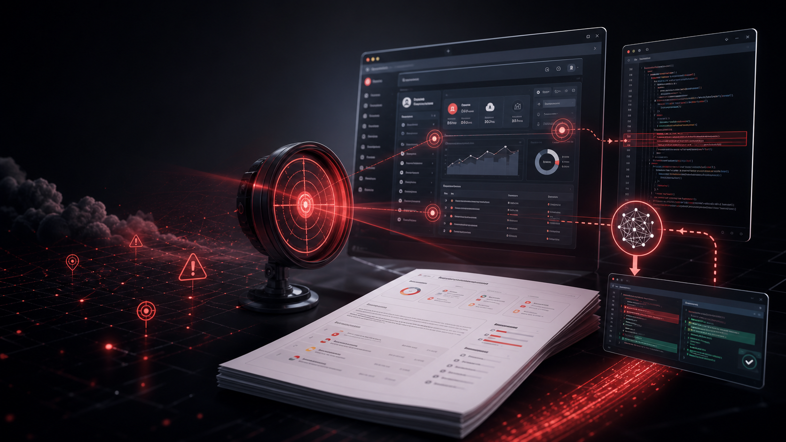

# RedLens



**Attack your own vibe-coded app before the internet does.**

RedLens is a portable Agent Skill that turns Codex, Claude Code, and OpenCode into a blackbox red-team operator for your own AI-built systems. It probes your app from the outside, finds the security mistakes vibe coding tends to hide, and generates a professional report you can paste back into your AI builder to fix the issues.

[](#install)
[](#why-redlens-exists)
[](#use)
[](#how-it-runs)
[](#cloakbrowser-built-in)
[](LICENSE)

## Why RedLens Exists

AI can help you build a SaaS in a weekend. It can also quietly ship:

- broken auth and session handling,
- IDOR/BOLA bugs that leak other users' data,
- exposed admin routes and forgotten debug panels,
- weak CORS, headers, JWT, and token handling,
- Supabase/RLS-style authorization mistakes,
- API endpoints hidden in frontend JavaScript,
- upload, webhook, billing, invite, and tenant-boundary flaws.

Most builders only discover these when real users, bots, or attackers touch the product.

RedLens gives you a better loop:

```text
Build with AI -> Run RedLens blackbox -> Get a professional report
              -> Paste report into your AI coder -> Fix -> Retest
```

## The Promise

RedLens does not try to be another noisy scanner wrapper. It is designed to behave like a disciplined pentest operator:

- **Blackbox first:** tests your app like an outside attacker would see it.
- **Built for AI builders:** outputs findings in a format you can hand back to Claude, Codex, Cursor, v0, OpenCode, or any coding agent.
- **Evidence-driven:** captures what was tested, what was found, what failed, and what still needs deeper review.
- **Report-first:** produces structured findings, remediation steps, retest guidance, and attack-chain narratives.
- **Mode-aware:** `quick`, `standard`, and `deep` control depth without turning quality into scanner spam.

## What Makes It Different

| The usual vibe-coded security check | RedLens |
| --- | --- |
| "Ask the AI if my app is secure" | Runs an external blackbox assessment workflow |
| One scanner dump | Evidence, coverage, gaps, and next actions |
| Vague "looks good" answer | Confirmed findings with reproduction and remediation |
| No context for the fixing AI | Report formatted so another AI can patch the app |
| Headless browser gets blocked | CloakBrowser workflow for authorized browser-dependent testing |
| No depth control | `quick`, `standard`, and `deep` contracts |

## What You Get

RedLens can produce a professional pentest package:

- executive summary,
- technical findings,
- affected assets and endpoints,
- reproduction steps,
- evidence artifact index,
- business impact and technical impact,
- remediation guidance,
- attack-chain narrative when findings combine,
- retest checklist,
- explicit gaps and recommended next depth.

The point is simple: **you should be able to give the report to an AI coding agent and say "fix this."**

## Assessment Modes

RedLens has depth modes that control runtime, not quality.

| Mode | Use It When | What You Get |
| --- | --- | --- |
| `quick` | You need fast signal now | Mandatory triage coverage, top risks, evidence, gaps, and next recommended mode |
| `standard` | You want the professional default | Broad inventory, validated findings, reproduction steps, remediation, and retest checklist |
| `deep` | You need the strongest assessment | Expanded enumeration, cross-tool validation, chained findings, artifacts, attack paths, and full reporting |

Default mode is `standard`.

## What RedLens Hunts For

- **Auth bugs:** weak sessions, missing re-auth, JWT flaws, reset/signup issues.
- **Authorization bugs:** IDOR, BOLA, tenant isolation failures, role bypasses.
- **API exposure:** hidden routes, OpenAPI/GraphQL/gRPC hints, undocumented endpoints.
- **Frontend leaks:** secrets, API paths, internal domains, feature flags in JavaScript.
- **Web vulns:** XSS, SQLi, SSTI, SSRF, path traversal, uploads, deserialization, CORS.
- **Business logic:** billing, coupons, invites, trial bypass, race conditions, workflow skips.
- **Infra exposure:** ports, services, dashboards, cloud-native misconfigurations.
- **Reporting gaps:** what was not tested, why, and what to run next.

## CloakBrowser Built In

Modern apps often do not show scanners the real app. They show a JS challenge, bot wall, or "Checking your browser" page.

RedLens includes a CloakBrowser workflow for authorized web assessments:

- Detect CDN and anti-bot challenge pages before wasting time with blocked CLI tools.
- Use CloakBrowser instead of regular Playwright, Puppeteer, or vanilla headless Chromium when browser realism matters.
- Extract rendered content and cookies, then feed that evidence back into CLI tooling.
- Keep browser use tied to scope, authorization, evidence, and reporting.

CloakBrowser reference: `skills/redlens/references/web/tools/cloakbrowser.md`

## Install

```bash
git clone https://github.com/wilsonferreira23/RedLens.git
cd RedLens
./scripts/install.sh
```

The installer copies RedLens to:

```text
~/.codex/skills/redlens
~/.claude/skills/redlens
~/.config/opencode/skills/redlens
~/.config/opencode/agents/redlens.md
```

## Use

Codex or Claude Code:

```text
Use RedLens in standard mode to blackbox test my own vibe-coded app at https://example.com and generate a report I can give to my AI coding agent to fix.
```

Claude Code command:

```text
/redlens run a quick authorized blackbox assessment of my app at https://example.com and list what my AI builder should fix first
```

OpenCode:

```text
@redlens run a deep authorized blackbox assessment of my own app at https://example.com within this scope: ...
```

## How It Runs

RedLens can operate through:

- **Local Kali:** direct shell commands on a Kali machine.
- **SSH Kali:** agent drives a full Kali VM/server over SSH.
- **Docker Kali:** persistent `kali-pentest` container for CLI automation.

It records work under `/tmp/kali-pentest-state/<target>/` so evidence, raw output, findings, and gaps are not lost between steps.

Professional runs can use structured state files: `engagement.json`, `findings.jsonl`, `evidence_manifest.jsonl`, `coverage.json`, and `command_log.jsonl`.

## The RedLens Loop

```text
Authorize -> Scope -> Choose mode -> Blackbox the app -> Save evidence
          -> Generate report -> Paste into AI builder -> Fix -> Retest
```

## Professional Reports

RedLens treats the report as the product:

- Structured findings, not scanner dumps.
- Evidence artifact index with hashes and redaction status.
- Business impact and technical impact separated.
- Attack chain narratives when findings combine.
- CVSS, CWE, OWASP, and MITRE ATT&CK mapping where relevant.
- Retest checklist and remediation roadmap.

## Validate The Package

```bash
python3 scripts/validate_skill.py
```

Expected:

```text
OK: RedLens skill package is valid
```

## Repository Layout

```text
assets/redlens-readme-cover.png               # README cover image
skills/redlens/SKILL.md                       # Canonical cross-agent skill
skills/redlens/references/playbooks/          # Mode contracts and assessment playbooks
skills/redlens/references/strategy/           # Operator brain, coverage gates, attack chains
skills/redlens/references/reporting/          # Professional report standards
skills/redlens/references/**/tools/           # Kali tool references
opencode/agents/redlens.md                    # OpenCode subagent adapter
scripts/install.sh                            # Installer for Codex, Claude Code, OpenCode
scripts/validate_skill.py                     # Package validator
```

## Safety

RedLens is for authorized testing of systems you own or are explicitly allowed to assess.

- No scanning or probing without authorization.
- Scope is binding: hosts, ports, accounts, time windows, and techniques matter.
- High-risk actions require a second explicit approval.
- RedLens should report what was tested, what was not tested, and what should happen next.

## Give It A Star

If you are building software with AI, do not just ask the AI if it is secure. Attack your own app in blackbox, get the report, paste it back into your AI builder, and fix the weak spots before users find them.

Star RedLens if you want AI-built apps to ship with fewer obvious security mistakes.

## License

MIT
